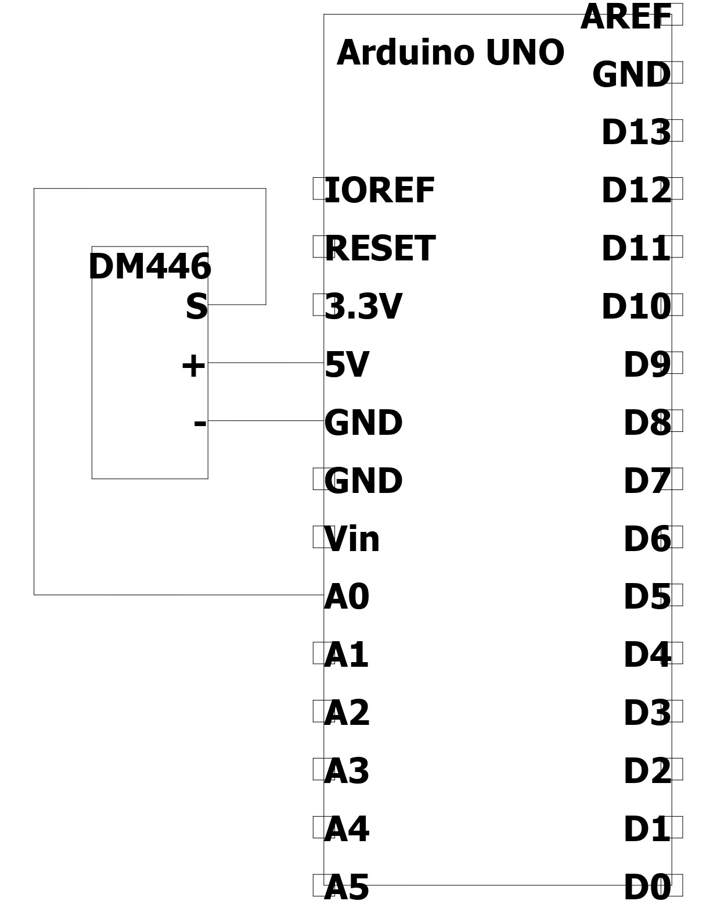
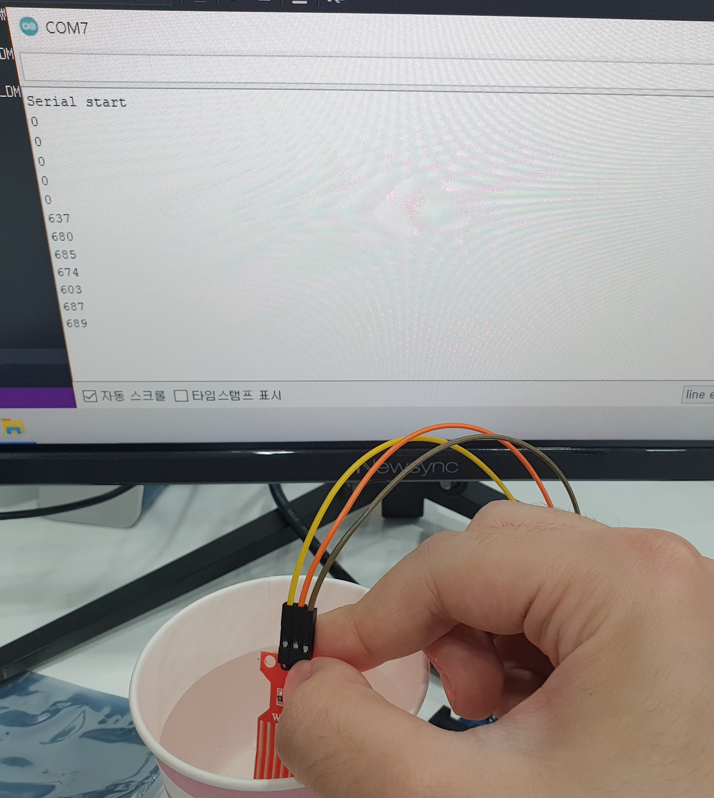

# DM446 water sensor
- 수위 감지 센서로 물에 직접 넣어서 작동합니다.
- 사용 후 센서에 물기가 남아 있을시 제대로 측정이 되지 않습니다. (측정 후 물기 제거가 필요합니다.)
- 센서의 회로 부분은 방수가 되지 않으므로 주의가 필요합니다.

## 제품 사진
(업로드 예정)

## 사양
	- 작동 전압 : 5V
	- 아날로그 출력

## 필요 하드웨어
	- DM446
	- Arduino UNO
	- UNO cable
	- F-M cable(3ea)

## 연결
	- A0핀 사용했으나 다른 아날로그 핀 사용가능

|DM446|Arduino|
|--|--|
|S|A0(변경 가능)|
|+|5V|
|-|GND|

## example_code.cpp
	1. 코드 보드에 업로드
	2. 시리얼 모니터 실행
	3. 센서 물에 담궈서 시리얼 모니터에 값이 출력되는지 확인

